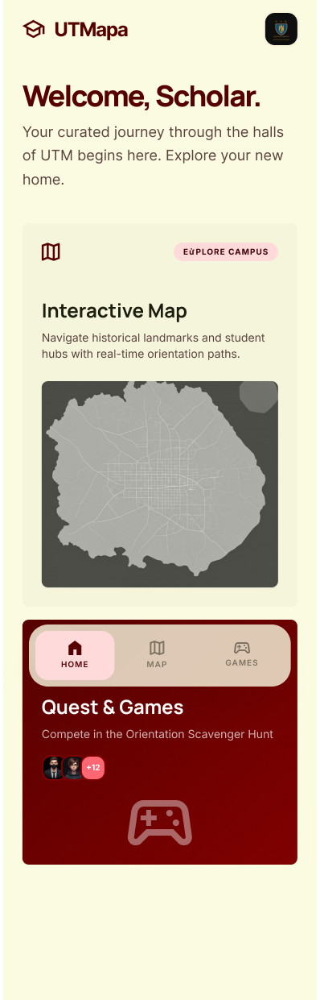
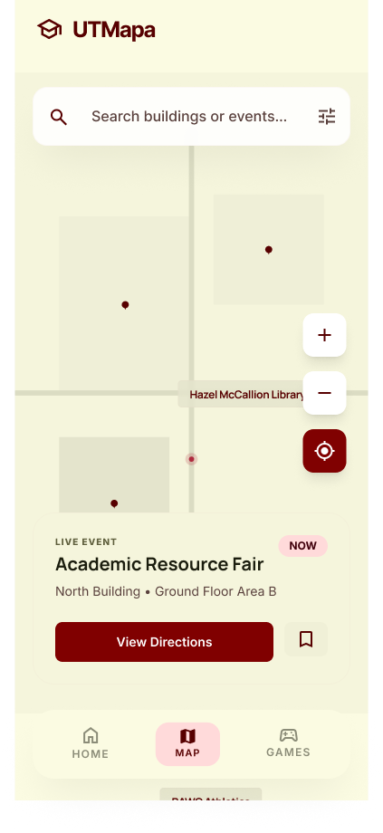
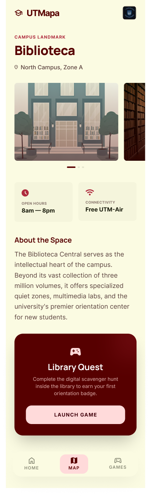

# 🗺️ UTMapa - Orientación UTM

## 📖 Descripción General del Proyecto
UTMapa es una aplicación móvil interactiva desarrollada para facilitar la navegación y orientación de los estudiantes de nuevo ingreso dentro de las instalaciones de la Universidad Tecnológica de la Mixteca (UTM). 

El objetivo principal es ofrecer una herramienta útil y entretenida que integra un mapa interactivo con ubicación GPS, información detallada de los espacios universitarios (galerías y descripciones) y elementos lúdicos (minijuegos) contextualizados con el entorno para reforzar el sentido de pertenencia y la experiencia del usuario.

## 👥 Integrantes del Equipo
* Fernando Tadeo Jimenez Castillo
* Zaeinmd Navarrete Marin

## 🛠️ Tecnologías a Utilizar (Propuestas, sujetas a cambio)
El proyecto se desarrollará utilizando **Flutter** como tecnología principal. Para cubrir los requerimientos funcionales, se propone el uso de las siguientes bibliotecas (paquetes):

* **`flutter_map`** o **`Maps_flutter`**: Para la implementación del mapa interactivo de la UTM con estilos personalizados (colores institucionales guinda y beige, vista plana 2D).
* **`geolocator`**: Para la navegación GPS y ubicación en tiempo real del estudiante dentro del campus.
* **`sensors_plus`**: Para capturar los datos del acelerómetro y giroscopio del dispositivo (necesario para el control de movimiento en el minijuego de fútbol).
* **`carousel_slider`**: Para la implementación fluida de las galerías de imágenes en cada punto de interés.

## 📱 Prototipos de las Pantallas (Bocetos UI/UX)
A continuación, se presenta la propuesta visual de la interfaz, diseñada con la paleta de colores institucionales.

|                    Pantalla Principal                    |           Búsqueda de un Pokémon           |                 Pokémon No Encontrado                 |
| :------------------------------------------------------: | :----------------------------------------: | :---------------------------------------------------: |
|  |  |  |

### Descripción de Pantallas Principales:
* **Pantalla de Inicio (Home):** Panel principal de bienvenida con el logotipo de la universidad y accesos rápidos mediante tarjetas (Mapa, Minijuegos, Directorio).
* **Mapa Interactivo:** Vista 2D minimalista del campus. Muestra la ubicación en tiempo real del usuario (punto azul GPS) y marcadores (pines) guindas para al menos 10 puntos de interés.
* **Detalle del Lugar (POI):** Al seleccionar un punto en el mapa (ej. Biblioteca o Canchas), se despliega una vista con una galería de imágenes, descripción del lugar, horarios y un botón de acción principal para iniciar el minijuego asociado a ese espacio.

## 🎮 Propuestas de Juegos Interactivos
Como parte de los elementos lúdicos, cada integrante del equipo desarrollará un minijuego contextualizado dentro de la app. Los detalles, mecánicas y bocetos de cada juego propuesto se encuentran documentados en sus respectivas carpetas:

* `/propuesta/sopa-letras-zaeinmd/`
* `/propuesta/trivia-tadeo/`
* `/propuesta/futbol-zaeinmd/`
* `/propuesta/deslizable-tadeo/`