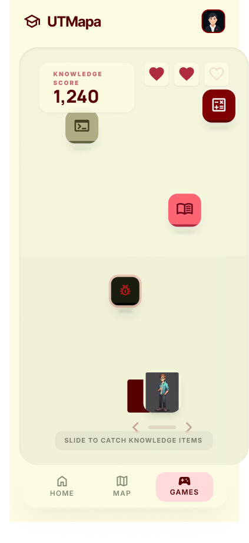

## Descripción del Juego
Este es un juego de agilidad estilo arcade, contextualizado visualmente en la **Aulas** o en las **Áreas Verdes** del campus. La premisa sitúa al jugador como un estudiante que debe prepararse rápidamente para su día de clases. Desde la parte superior de la pantalla caerán diversos objetos a distintas velocidades. El usuario deberá deslizar el dedo horizontalmente en la pantalla para mover una mochila y atrapar elementos positivos (calculadoras, libros de texto, apuntes), mientras esquiva objetos negativos que restan vidas (como "bugs" de software).

La dinámica busca ofrecer una pausa entretenida e interactiva mientras los estudiantes exploran el mapa de las instalaciones, fomentando la rapidez visual y la familiarización con elementos de la vida universitaria.

## Pantalla Principal de Juego
Esta vista presenta la dinámica central de la lluvia de objetos:

* **Descripción Visual:** Contiene el entorno principal donde ocurre la acción, la mochila controlable por el usuario en el eje horizontal inferior para recolectar los ítems, y un panel superior que indica el puntaje actual ("Score") y los "corazones" que representan las vidas restantes.

