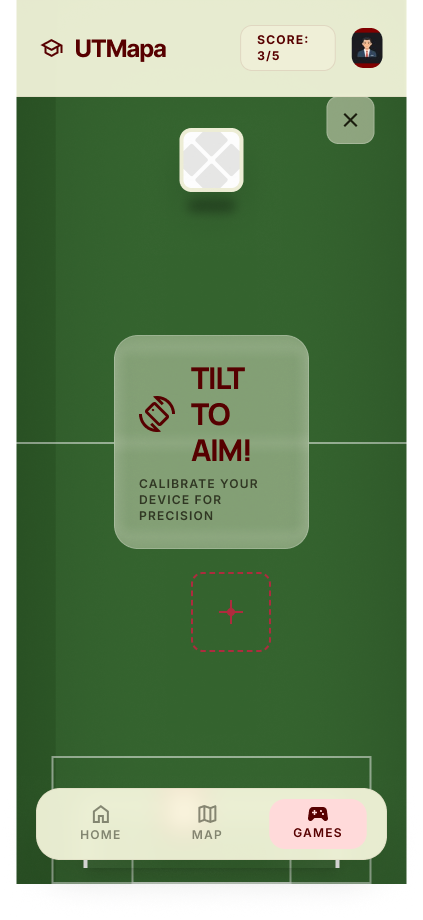

# Minijuego: Tiro a Gol (UTM)

Minijuego de estilo **futbolito** integrado en el mapa interactivo de la **Universidad Tecnológica de la Mixteca**.

### Cómo jugarlo
1. Localiza las **canchas** en el mapa interactivo de la UTM.
2. Haz clic en el icono del juego para iniciar.
3. El objetivo es anotar goles superando al portero.

### Reglas
* **Victoria:** Anotar **3 goles**.
* **Derrota:** No lograr el objetivo (según límite de intentos o tiempo).

### Propuesta Visual

---