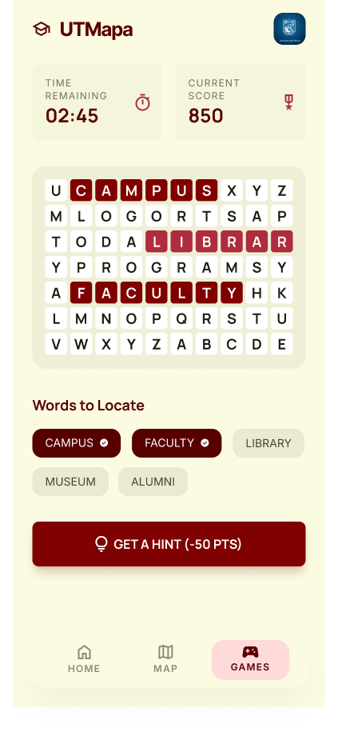

# Minijuego: Sopa de Letras (UTM)

Minijuego de estilo **sopa de letras** integrado en el mapa interactivo de la **Universidad Tecnológica de la Mixteca**.

### Cómo jugarlo
1. Localiza las **Biblioteca** en el mapa interactivo de la UTM.
2. Haz clic en el icono del juego para iniciar.
3. El objetivo es encontrar todas las palabras a buscar.

### Reglas
* **Victoria:** Encontrar las todas las palabras a buscar.
* **Derrota:** No lograr el objetivo (según límite de intentos o tiempo).

### Propuesta Visual

---