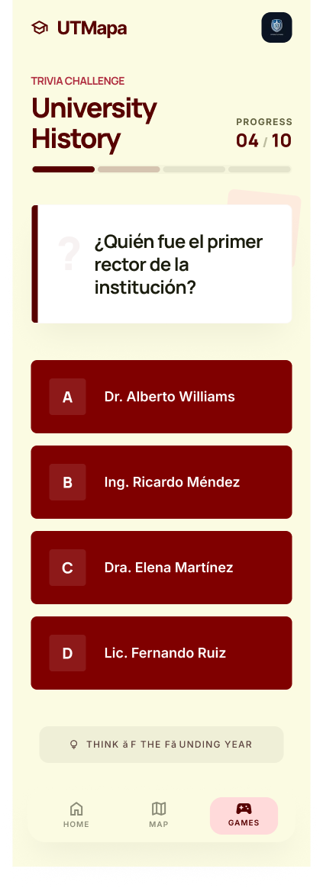

## Descripción del Juego
Este minijuego es una dinámica interactiva de preguntas y respuestas con límite de tiempo, diseñada para ubicarse en el **Salas de Cómputo** o en la sección de **Servicios Escolares** dentro del mapa interactivo de la app. El objetivo es que los estudiantes de nuevo ingreso pongan a prueba sus conocimientos sobre los trámites básicos de la universidad, ubicación de edificios y conceptos introductorios de las materias de tronco común. Conforme el jugador responde correctamente, su "promedio virtual" se incrementa, ofreciendo una experiencia retadora y educativa.

**Uso de Inteligencia Artificial:** Para la generación del banco de preguntas masivo, se utilizarán herramientas de Inteligencia Artificial (LLMs). Este uso estará documentado formalmente en los comentarios del código fuente. Todo el contenido generado será curado y adaptado manualmente para asegurar que el contexto sea 100% fiel a la realidad y a los servicios de la Universidad Tecnológica de la Mixteca.

## Pantalla Principal de Juego
Esta vista presenta la dinámica central de la trivia:

* **Descripción Visual:** Muestra la pregunta actual claramente en la parte superior (Material Design Card), un temporizador visual en cuenta regresiva y cuatro botones interactivos en color guinda con las opciones de respuesta. Incluye una barra de progreso que indica cuántas preguntas faltan para terminar la ronda.

